# WEEK 7

[TOC]

# 决策树

## 猫猫分类案例-可爱捏

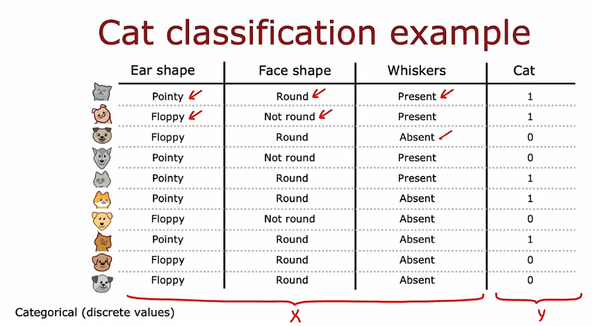

跟绿萝一样，根在上面，叶子在下面

**root node**-根部节点，**decision nodes**-决策节点，**leaf nodes**-叶节点

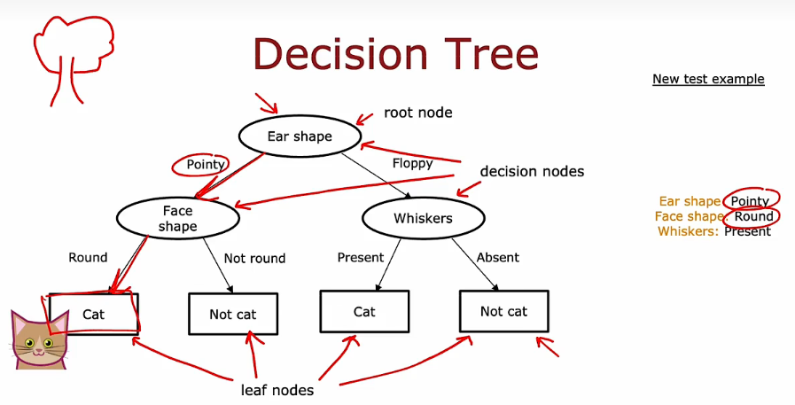

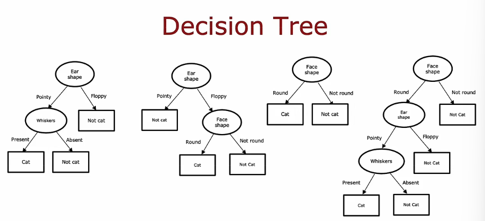

## 学习过程-learning process

先按耳朵形状分类

然后按照脸型分类

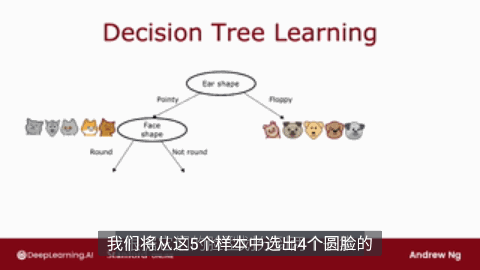

当样本足够纯（全是猫or全不是猫）时，添加叶节点

1. 怎么确定用什么特征来划分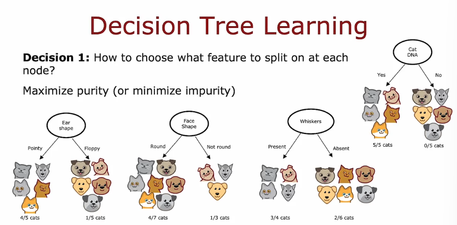
2. 何时停止分类（很纯的时候or有限制深度or纯度增加太小时or精度达到时）

## 熵的引入

entropy-熵，数值越大越不纯

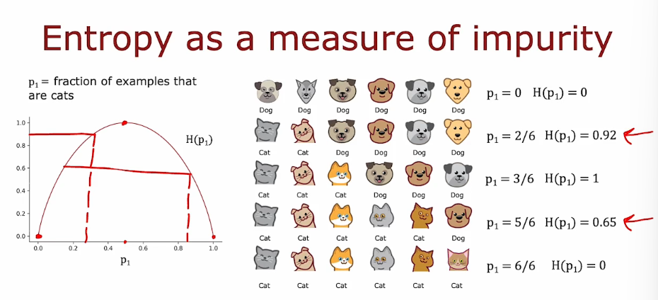
$$
显然，p_{a}=1-p_{1-a}
$$

实际上之前的那个代价函数就是交叉熵，算是这个的一种

## 选择拆分信息增益

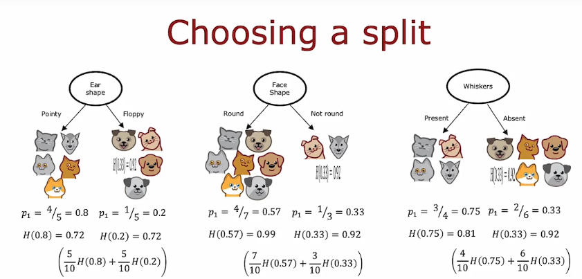

我们比较希望出现小的，因为越接近0，他的内容就越纯（全是猫，或全是狗）我们就可以给他添加叶节点了。我们可以看熵的变化-**information gain**，下一层熵的值用加权平均计算。

下降多的表现更好

## 整合

从左到右依次加入leaf node-叶节点

**recursive algorithm**-递归算法-不断地建立小的决策树

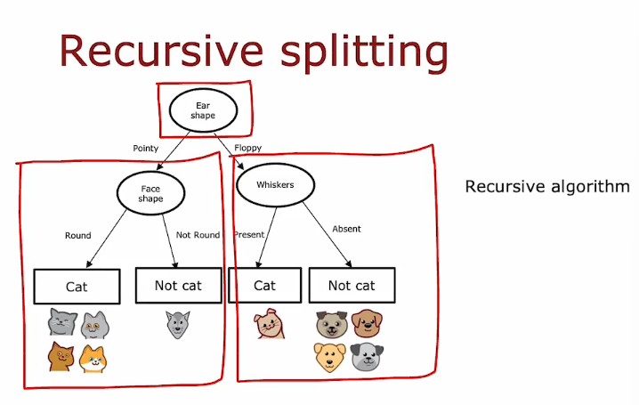

有很多方法来决定何时停止，实际上也有很多的开源库可以利用。

# 分类特征

## 独热-one hot

> 上述我们的那些都是二元值，而我们下面用的是多元的编码

二进制的表达方式（实际计算时就是按照1.0划分）

**one-hot encoding**-独热编码，这样就可以取更多的离散特征值

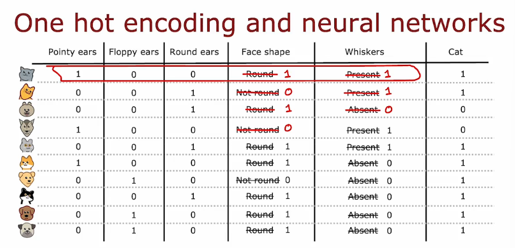

## 连续值的特征

选择信息增益最好的那一个中间值

# 推广

## 回归树-regression trees

图中是求的平均值

（此时就不考虑熵的变化，而是要考虑减少方差了）计算加权方差

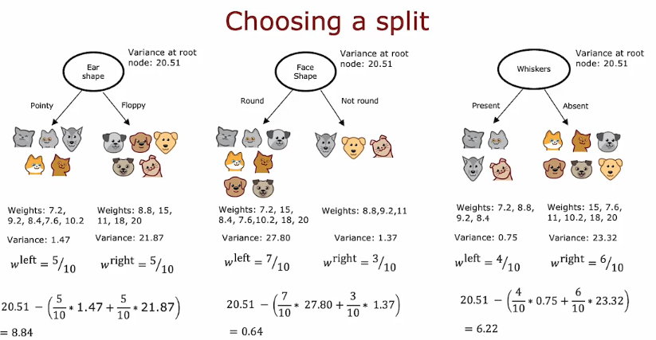

## 集成树-tree ensembles

> 单个的树对信息的敏感性很高

这样的话，整体的树就不会对某个数据过于敏感

## 有放回抽样-sampling with replacement

replacement-放回

## 随机森林法

> 非常强大的一种树模型，

最后让这些树群进行投票，往往更加有效，相对于单个树来说（其实就是为了快而增大训练量）

为了让树与树之间差异较大（要是都一样那也没意思）所以特征选择一般是n个的元素个数为k的子集，然后以这k个特征来训练(k一般取$\sqrt{n}$)

## XGBoost-eXtreme Gradient Boosting

>  决策树集成方法-XGBoost

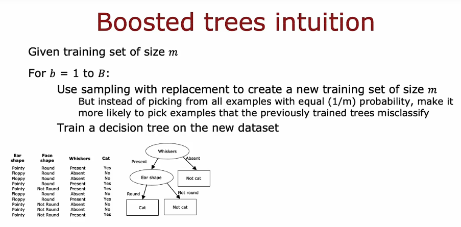

更多的选择让之前决策错误的例子（多样性训练集）-这样就像可以练习，每次都练习自己不熟悉的部分

下面介绍这个开源的算法的优点

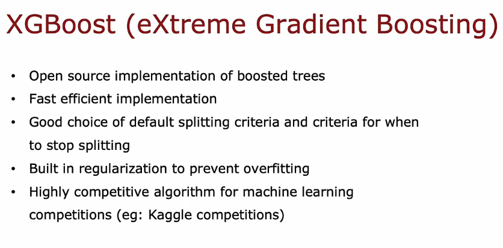

# 什么时候用决策树

> 表格数据（不建议用在图像，音频上）

神经网络中更多的调用连续函数，更加方便梯度下降训练

