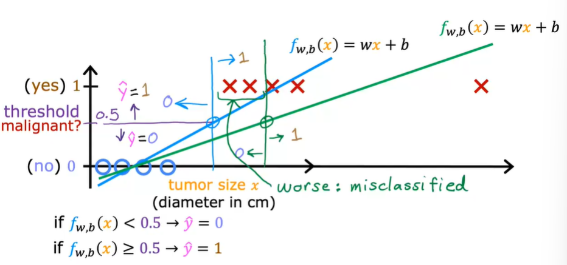
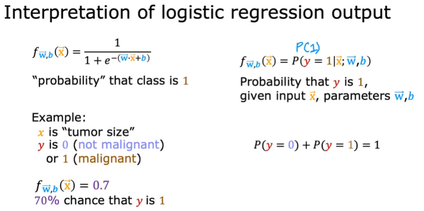
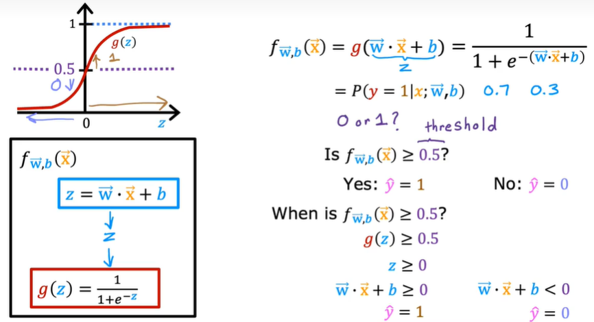
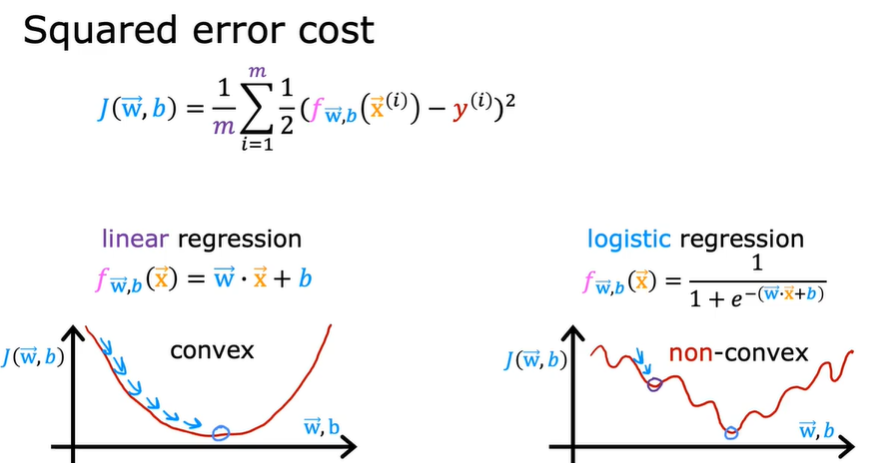
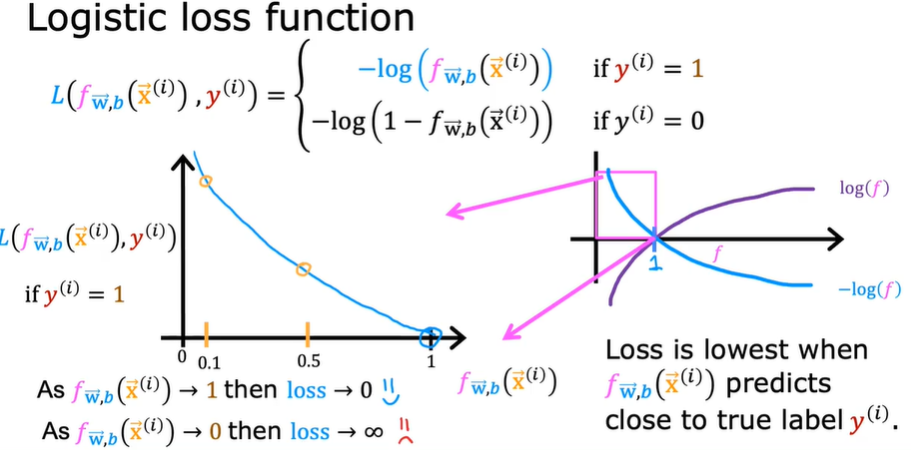
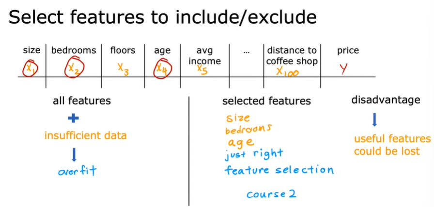
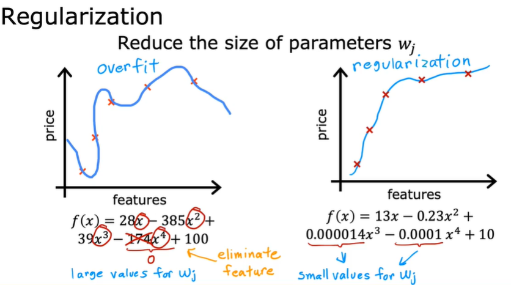
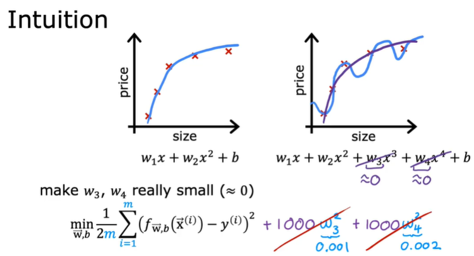
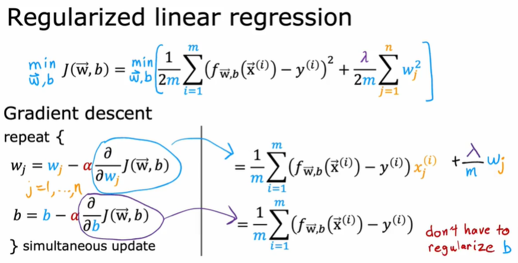
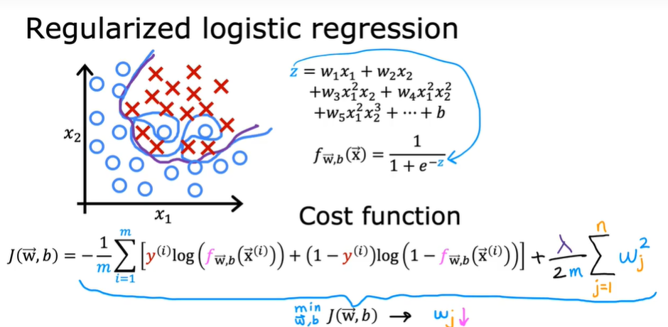

# WEEK 3

[TOC]

# 逻辑回归-Logistic regression

> 对于模型的输出-“y的值”，只对2元分类问题的中间过渡部分起作用，其他的具体形状之类的还是要用其他函数构成复合函数

**binary classification**-二元分类问题（class与category对等，即都代表了表示的结果类型）

逻辑回归指用0.1逻辑值表示输出（是，否；对，错；这边，那边。。。）

在分类的问题中，线性模型的线性性质会影响一定的判断。（添加了一个误差较大的值之后线性模型变化较大）

**sigmoid（logistic）function**-激活函数

考虑到概率问题

## 决策边界

逻辑函数都是带入到这个g函数中，这是我们预测的边界。[深度学习笔记：如何理解激活函数？（附常用激活函数）-知乎](https://zhuanlan.zhihu.com/p/364620596)

## 逻辑回归的代价函数-Cost function for logistic regression

以前的平方差公式并不是一个很好的评估公式

因为有0.1所以会有一些急剧的变化，此时不好取极小值，有很多局部极小值。

## 逻辑回归的代价函数

==最后会是一个**凸函数**（证明）==

以及为什么要用这个函数作为代价函数[损失函数：交叉熵详解 - 知乎](https://zhuanlan.zhihu.com/p/115277553)

> 总的来说就是信息熵，使得你的成本预算与实际价值成正比，上面是相当于交叉熵的形式，之不过取0.1的时候有一个项分别被删去了，交叉熵就表现出了你这个模型与实际模型之间的分布差异

例如，假设0和01都是码字，那么我们就不清楚编码字符串0100111的第一个码字是什么，因为可能是0，也可能是01。 我们想要的属性是，任何码字都不应该是另一个码字的前缀。 这称为**前缀属性**，遵守该属性的编码称为**前缀编码**。（信息传输的过程中会一起发送）

实际上就是极大似然估计的形式表达（使得两个分布相同概率最大的参数选取）**极大似然函数**

逻辑回归的梯度下降，
$$
关于导数的推导过程：\\
J(\vec w,b) &= -\frac{1}{m} \sum_{i=1}^{m}[y^{(i)}ln(f_{\vec w,b}(\vec x^{(i)})) + (1-y^{(i)})ln(1-f_{\vec w,b}(\vec x^{(i)}))]\\
& = -\frac{1}{m} \sum_{i=1}^{m}[y^{(i)}ln(\frac{1}{1+e^{-(\vec wx+b)}}) + (1-y^{(i)})ln(\frac{e^{-(\vec wx+b)}}{1+e^{-(\vec wx+b)}})]\\
&= \frac{1}{m} \sum_{i=1}^{m}[y^{(i)}ln(1+e^{-(\vec wx+b)}) + (1-y^{(i)})ln({e^{\vec wx+b}}+1)]\\
\frac{\partial J(\vec w,b)}{\partial w_j}&=\frac{1}{m} \sum_{i=1}^{m}[y^{(i)}\frac{\partial ln({1+e^{-(\vec wx+b)}})}{\partial w_j}+ (1-y^{(i)})\frac{\partial ln(e^{\vec wx+b}+1)}{\partial w_j}]\\
&=\frac{1}{m} \sum_{i=1}^{m}[y^{(i)}\frac{-x_j^{(i)}e^{-(\vec wx+b)}}{1+e^{-(\vec wx+b)}}+ (1-y^{(i)})\frac{x_j^{(i)}e^{\vec wx+b}}{1+e^{\vec wx+b}}]\\
&=\frac{1}{m} \sum_{i=1}^{m}[y^{(i)}\frac{-x_j^{(i)}}{1+e^{\vec wx+b}}+ (1-y^{(i)})\frac{x_j^{(i)}e^{\vec wx+b}}{1+e^{\vec wx+b}}]\\
&=\frac{1}{m} \sum_{i=1}^{m}[y^{(i)}\frac{-1}{1+e^{\vec wx+b}}+ (1-y^{(i)})\frac{e^{\vec wx+b}}{1+e^{\vec wx+b}}]x_j^{(i)}\\
&=\frac{1}{m} \sum_{i=1}^{m}[\frac{e^{\vec wx+b}}{1+e^{\vec wx+b}}+y^{(i)}\frac{-1-e^{\vec wx+b}}{1+e^{\vec wx+b}}]x_j^{(i)}\\
&=\frac{1}{m} \sum_{i=1}^{m}[\frac{e^{\vec wx+b}}{1+e^{\vec wx+b}}-y^{(i)}]x_j^{(i)}\\
&=\frac{1}{m} \sum_{i=1}^{m}[\frac{1}{1+e^{-(\vec wx+b)}}-y^{(i)}]x_j^{(i)}\\
&=\frac{1}{m} \sum_{i=1}^{m}[f_{\vec w,b}(\vec x^{(i)})-y^{(i)}]x_j^{(i)}\\
\frac{\partial J(\vec w,b)}{\partial b}&=\frac{1}{m} \sum_{i=1}^{m}[y^{(i)}\frac{\partial ln({1+e^{-(\vec wx+b)}})}{\partial b}+ (1-y^{(i)})\frac{\partial ln(e^{\vec wx+b}+1)}{\partial b}]\\
&=\frac{1}{m} \sum_{i=1}^{m}[y^{(i)}\frac{-e^{-(\vec wx+b)}}{1+e^{-(\vec wx+b)}}+ (1-y^{(i)})\frac{e^{\vec wx+b}}{1+e^{\vec wx+b}}]\\
&=\frac{1}{m} \sum_{i=1}^{m}[f_{\vec w,b}(\vec x^{(i)})-y^{(i)}]\\
二阶导数下凸的证明：\\
\frac{\partial^2 J(\vec w,b)}{\partial w_j^2}&=\frac{\partial \frac{1}{m} \sum_{i=1}^{m}[f_{\vec w,b}(\vec x^{(i)})-y^{(i)}]x_j^{(i)}}{\partial w_j}\\
&=\frac{1}{m} \sum_{i=1}^{m}\frac{x_j^2e^{-(\vec wx+b)}}{(1+e^{-(\vec wx+b)})^2}>0\\
$$

scikit-learn函数

# 欠拟合与过拟合-underfitting and overfitting

## 欠拟合与过拟合的介绍

> 无端瞎想：龙格现象

**regularization**正则化来解决过拟合问题

- **high-bias**-这里指欠拟合（强偏差）（性别种族特征嘎嘎）

  

- **generalization**-泛化(我们最希望的一个)

  

- **overfitting**-过拟合 or **high variance**-高方差

  

  

  

  ## 解决过拟合问题(三种方法)

  1. **增加样本数据**
  2. **特征选择**（减少特征数量/训练集维数）
  3. **正则化-regularization**（不是把系数变成0，而是变成尽量小）

  > 对b的正则化影响不大，不建议对其进行改动

  # 带正则化的代价函数-Cost function with regularization

  ## 代价函数的改进

  这里是代入计算了，比方说x取10，就有1000w_3，这里只是表示x取得很大时w惩戒系数比较大。

可以惩戒所有的特征（都给他变小）

两个权衡取最小，至于怎么取$\lambda$

## 线性回归的正则化

梯度下降法的变化

进阶技巧

实际上**前面的系数**说明了每次得带w都会变小一些，**后面的**是寻找最低点的迭代

# 逻辑回归的正则化

