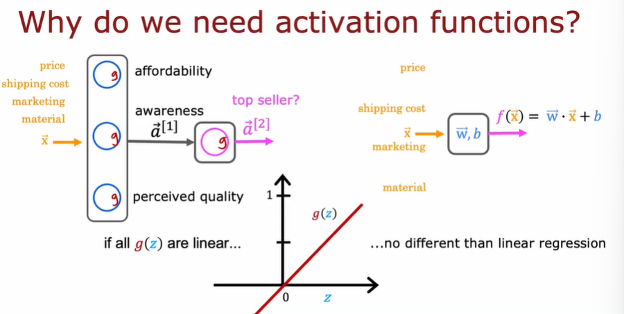
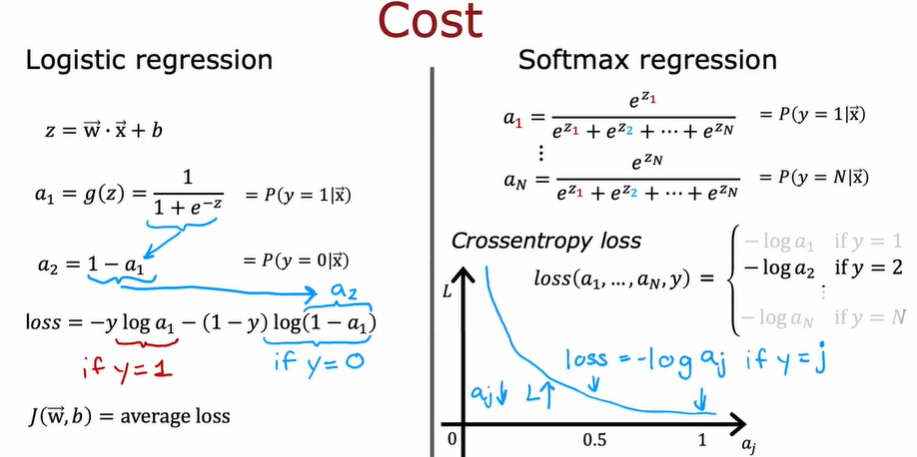
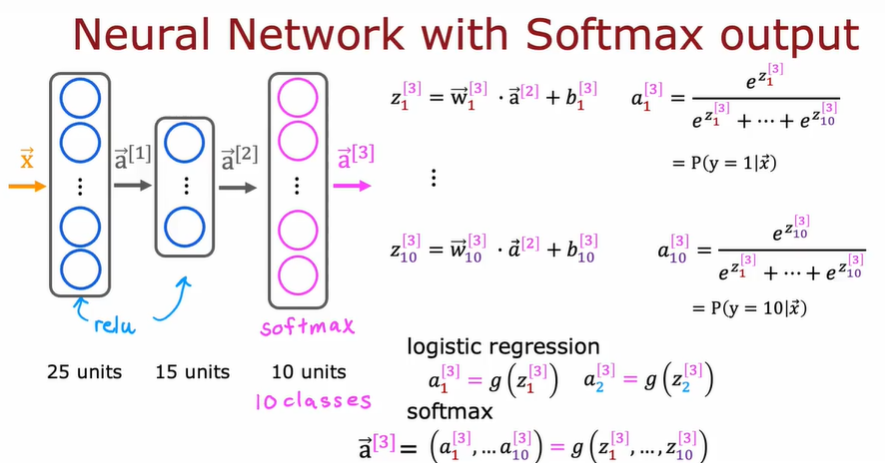
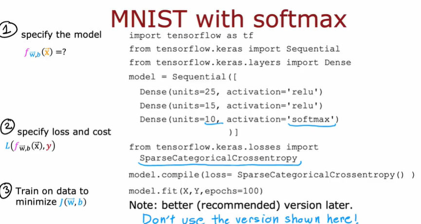
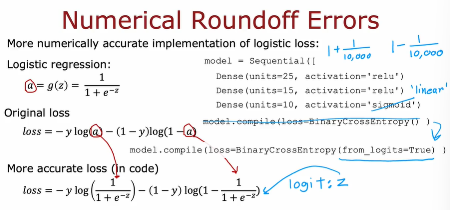
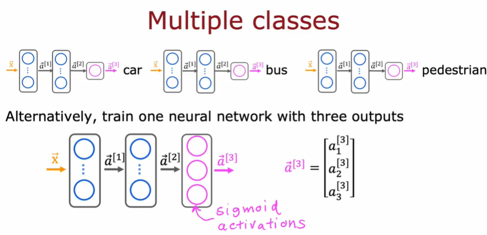
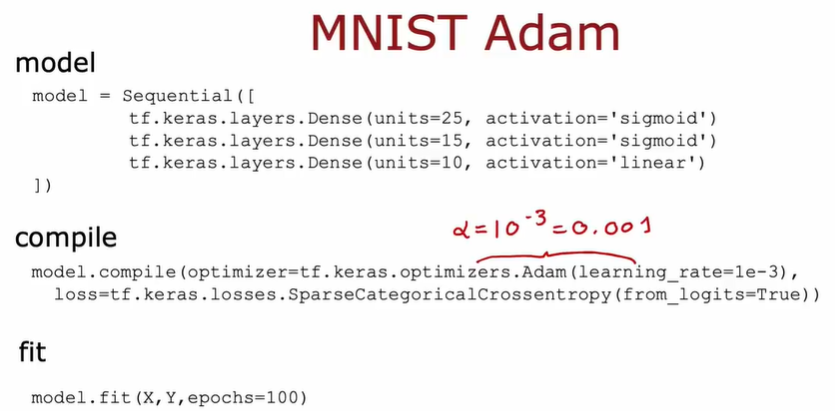
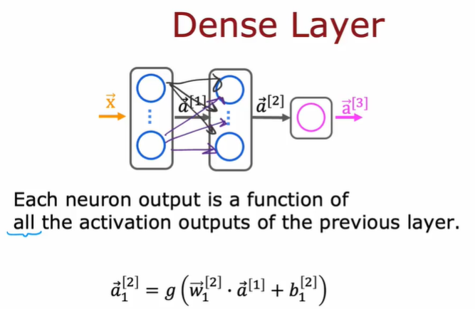

# WEEK 5

[TOC]

# 训练神经网络

## 模型代码介绍

**SparseCategoricalCrossentropy**-稀疏分类交叉熵

- Step 1 构造模型
- Step 2 定义代价函数-compile（编译）
- Step 3 拟合函数

## 训练细节

**specify**-指定，列入

下面详细介绍神经网络的细节：**BinaryCrossentropy**-二元交叉熵函数

可以调用[不同的损失函数](https://zhuanlan.zhihu.com/p/44216830)such as **MeanSquaredError**-平方差

实际上要求偏导时在函数中都帮你做到了。

（大佬们的库）

# 激活函数

## 之前讲过的一些激活函数

把很多很多的0.1函数写进整个模型：就像神经元一样。

ReLU函数-**Rectified Linear Unit**(矫正线性函数)

## 激活函数的选择

- 二元分类问题-**Sigmoid**
- 回归问题-**Linear activation functions**线性激活函数
- 非负回归问题-**ReLU**

往往**Sigmoid**会使得梯度下降变慢

每年都会有新的激活函数提出

## 激活函数的重要性

> 就是不要老去用线性回归，本末倒置了

像这样化成两层去线性回归，还不如直接用一个线性回归。

每层中都用线性回归，最后用sigmoid的话，结果出来跟逻辑回归没区别

# 多类问题-Multiclass Problem

## 多类问题介绍

> 个人想法：把后三类分成一类，然后一步一步二分类（比较慢）

## Softmax激活函数

**embelish**-美化（泛化，推广）

n=2的时候
$$
a_1 = \frac{e^{z_1}}{e^{z_1}+e^{z_2}} = \frac{1}{e^{z_1-z_2}+1}\\
a_2 = \frac{e^{z_2}}{e^{z_1}+e^{z_2}} = \frac{1}{e^{z_2-z_1}+1}
$$
所以参数会有些不一样（因为之前是$z$后面的是$z_1-z_2$，所以$z = z_1-z_2$，参数上也会发生相对的变动。

是等价的，但是数值上不一定是一样的，用ln函数只要是加大惩罚力度，让$a_j$达到接近1的情况（其实另一个会趋近于oo，主要还是加快迭代速度），以使得代价函数最小。

## softmax与神经网络

特有属性，比喻要把所有的z计算出来才可以算a

**SparseCategoricalCrossentropy**-稀疏类

## softmax改进代码

> 怎么更加精确的计算

表明直接的表达式会更加的精确

把z记为中间量而不是a

对之前的逻辑回归问题

# 多标签分类问题-Multi-label classification

**pedestrain**-行人

- **多类型**与**多标签**的差异
- 多类型输出的是每一种值的可能性（0.1，0.2，0.7）

- 多标签输出的是每一个的取值（0，1，0）

# 进阶优化算法

之前的是一个固定的learning rate，现在，我们可以找到一个更加自动化的算法**Adam**

**Adaptive Moment estimation**算法

**Robust**-健壮（容错更高）

# 小拓展

**dense layer type**-连接层（后一项数据由前一项给出）

卷积层-**convolutional layer**，卷积神经网络-**CNN**（convolutional neural network）

目前一些其他的前沿模型：**Transformer**,**LSTM**(长短期记忆网络）,**attention**（注意力模型）

