# WEEK 6

[TOC]

# 前言

**fruitful**-卓有成效的

**diagnostics**-诊断学 

# 模型评估-ebaluating model

## 应用到线性回归

如果只是绘制，那么4维数据就画不出来了；划分训练集，一部分训练，一部分检验。

三七分或者二八分

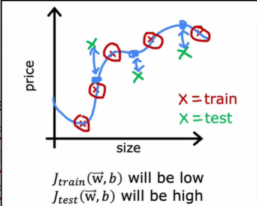

## 应用到分类问题

被错误分类了，就记为1，所以J的数值代表了分类错误的数据个数。

# 模型选择与交叉验证

## 选择方法与交叉验证

这样其实有一些推广后的误差，不是很合适。下面介绍一下怎么筛选更加科学。

**cross validation**-交叉训练集，用来检验准确性，其他称呼：

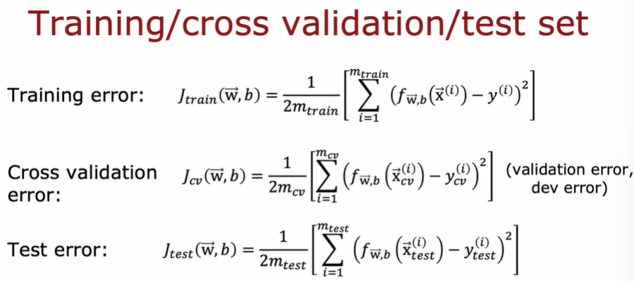

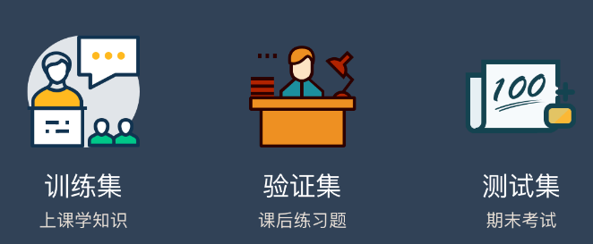

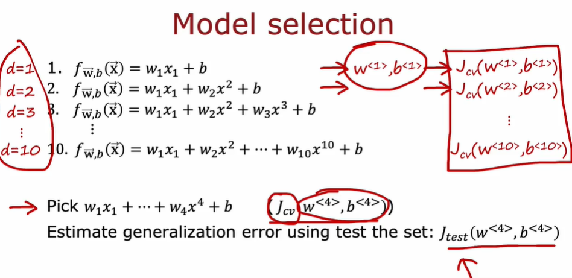

也可以用到神经网络上（不同的层数，不同的单元）

[本初ben](https://www.zhihu.com/question/265443164/answer/2417856431)

- **训练集**

**参与训练**，模型从训练集中学习经验，从而不断减小训练误差。这个最容易理解，一般没什么疑惑。

- **验证集**

**不参与训练**，用于在训练过程中检验模型的状态，收敛情况。验证集通常用于调整超参数，根据几组模型验证集上的表现决定哪组超参数拥有最好的性能。

同时验证集在训练过程中还可以用来监控模型是否发生过拟合，一般来说验证集表现稳定后，若继续训练，训练集表现还会继续上升，但是验证集会出现不升反降的情况，这样一般就发生了[过拟合](https://www.zhihu.com/search?q=过拟合&search_source=Entity&hybrid_search_source=Entity&hybrid_search_extra={"sourceType"%3A"answer"%2C"sourceId"%3A2417856431})。所以验证集也用来判断何时停止训练。

- **测试集**

**不参与训练**，用于在训练结束后对模型进行测试，评估其[泛化能力](https://www.zhihu.com/search?q=泛化能力&search_source=Entity&hybrid_search_source=Entity&hybrid_search_extra={"sourceType"%3A"answer"%2C"sourceId"%3A2417856431})。在之前模型使用**验证集**确定了**超参数**，使用**训练集**调整了**可训练参数**，最后使用一个从没有见过的数据集来判断这个模型的好坏。 **需要十分注意的是：测试集仅用于最终评价模型的好坏，在测试集上得到的指标可以用来和别人训练的模型做对比，或者用来向别人报告你的模型效果如何。切记千万不能根据模型在测试集上的指标调整模型超参数（这是验证集应该干的事情），这会导致模型对测试集过拟合，使得[测试集](https://www.zhihu.com/search?q=测试集&search_source=Entity&hybrid_search_source=Entity&hybrid_search_extra={"sourceType"%3A"answer"%2C"sourceId"%3A2417856431})失去其测试效果的客观性和准确性。**

# 模型参数选择

## 诊断方差偏差

从这里就只考虑train跟cv两个数据集了，text数据集只是用来做展示（输出）用的，不参与状态检验，只是用来评估

单个变量比较直观，**bias**-偏差，**variance**-方差

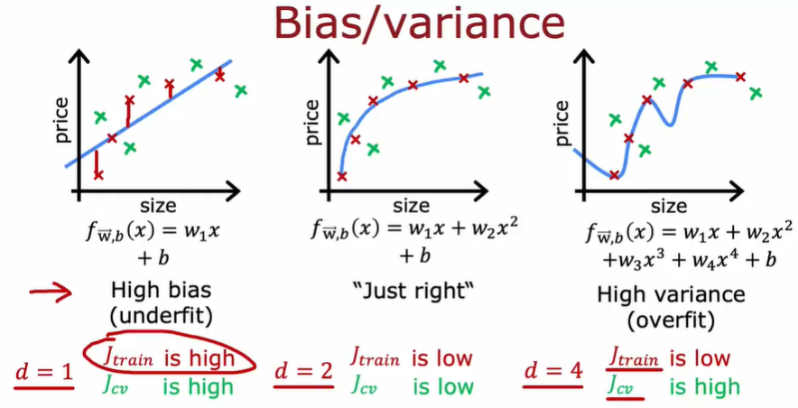

可以画出不同模型下的偏差与方差的图像

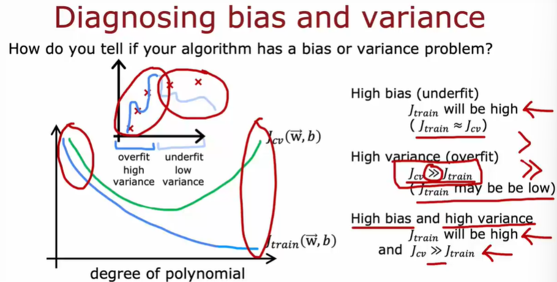

两者同时发生：那就太惨了

- 高偏差-high bias：训练集训练的不够拟合
- 高方差-high variance：cv集比训练集表现得还差

## 正则化参数

$\lambda$大会把w的值压低，越不尊重实际的训练值（Jtrain会变大）

看着是对称的（方差看Jcv，偏差看Jtrain）

- ==左侧==的**左边**是$\lambda$比较小，过拟合，方差大，偏差小，**右边**是$\lambda$比较大，欠拟合，方差大，偏差大

- ==右侧==是**左边**次数低，欠拟合，方差大，偏差大，**右边**是次数高，过拟合，方差大，偏差小

# 误差的分析

## 搭建性能-Baseline（基线）

例子：语音识别：尽管看着他的方差，误差都挺大的，实际上人类自己识别也很难

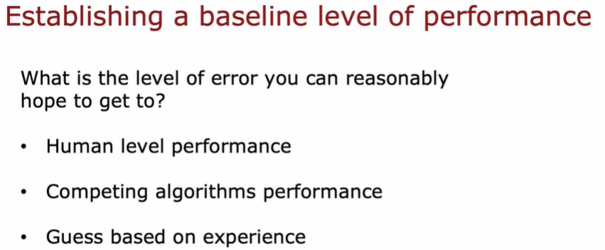

要建立个性化的性能基准

## 学习曲线-Learning curves

三个点确定一个二次方程（三个未知数）

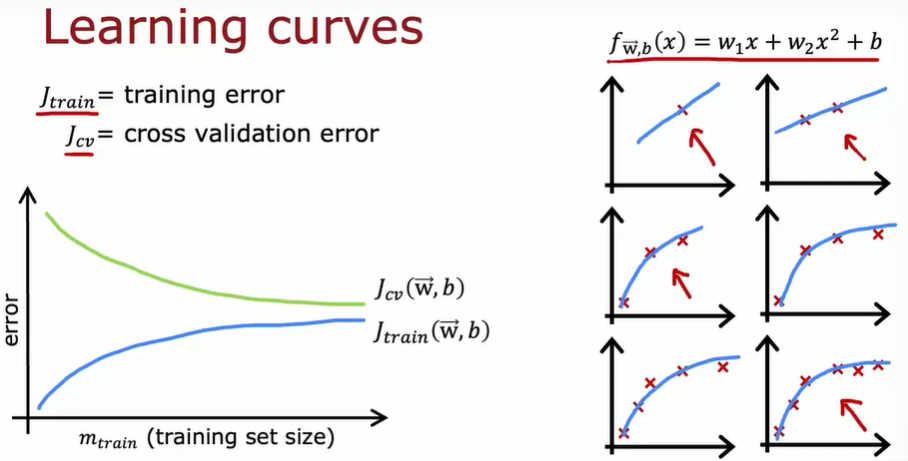

- **high-bias**

> 因为是$J_{train}$跟$J_{cv}$取得平均值，所以不会取余无穷（无穷的1取平均最后也是1），而且大于最小值，小于最大值（最大值与最小值有限）故这个平均值有界

- **high-variance**

误差低到不切实际

实际上最好的情况是三者相等，模型最接近人类（一味的扩大训练集，花费很很高）

## 误差与方差的分析（下一步该改进什么）

> 考虑的多了之后，有足够的信息去评估，就不会出现欠拟合情况(high bias)

- 扩大训练集-让拟合想过更好，更符合现实，对于high bias问题作用不大，但是能使得high variance更加拟合
- 减少特征向量-模型不会过于复杂（不会过拟合）对于high variance更小，但是对于high bias甚至可能从过拟合变成欠拟合
- 增加特征向量-模型变复杂，像过拟合过度所以对high bias有效，high variance作用小
- 增加次数项-相当于增加特征向量
- 减小$\lambda$-w的占比更小，自由发挥，趋向于过拟合，治疗high bias的问题
- 增大$\lambda$-w的占比变大，会压制w，趋向于欠拟合，治疗high variance的问题

> 主要是看趋向于欠拟合还是过拟合，==欠拟合（high bias）==，==过拟合（high variance）==

- **high variance**：1，增加训练集；2，简化模型：减少特征向量or增大$\lambda$；这样就很难拟合复杂曲线。
- **high bias**：复杂模型：增加特征向量or减小$\lambda$

# 神经网络与误差偏差

**tradeoff**-权衡

首先进行模型扩张，起码要比人强

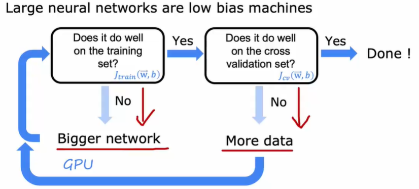

> 误差大了就扩大网络，方差大了就增多数据

只要正则化选择的正确，就不会出现过拟合导致方差增大，==大的网络往往更好==

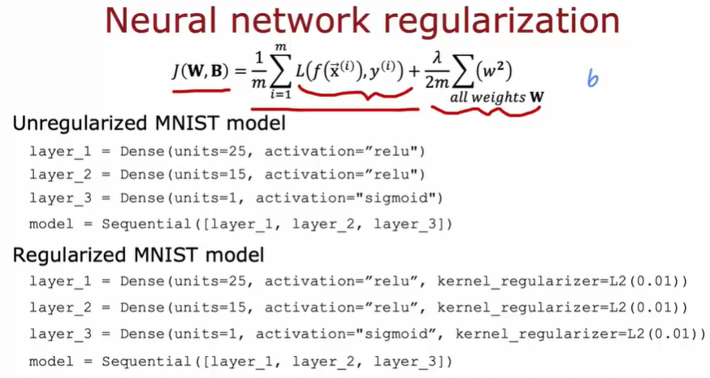

**非正则化**与**正则化**的模型

# 机器学习的迭代循环

蜜罐计划-**Honeypot**

蜜罐的定义（from 百度）

首先我们要弄清楚一台蜜罐和一台没有任何防范措施的计算机的区别，虽然这两者都有可能被入侵破坏，但是本质却完全不同，蜜罐是网络管理员经过周密布置而设下的“黑匣子”，看似漏洞百出却尽在掌握之中，它收集的入侵数据十分有价值；而后者，根本就是送给入侵者的礼物，即使被入侵也不一定查得到痕迹……因此，蜜罐的定义是：“蜜罐是一个安全资源，它的价值在于被探测、攻击和损害。”

设计蜜罐的初衷就是让黑客入侵，借此收集证据，同时隐藏真实的服务器地址，因此我们要求一台合格的蜜罐拥有这些功能：发现攻击、产生警告、强大的记录能力、欺骗、协助调查。另外一个功能由管理员去完成，那就是在必要时候根据蜜罐收集的证据来起诉入侵者。

# 如何高效的改进模型

## 误差分析-error analysis

有的很多错误分类的数据，自己看一遍然后分析其中的问题所在

指出模型实际上应该朝着什么方向发展才更好（再怎么优化恶意拼写，也只能解决3%的问题）

**pharma**-药品

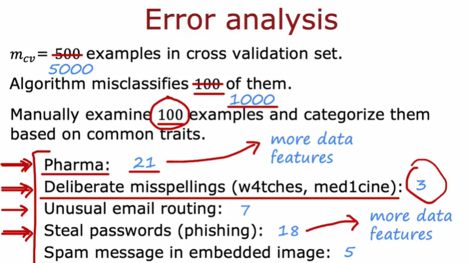

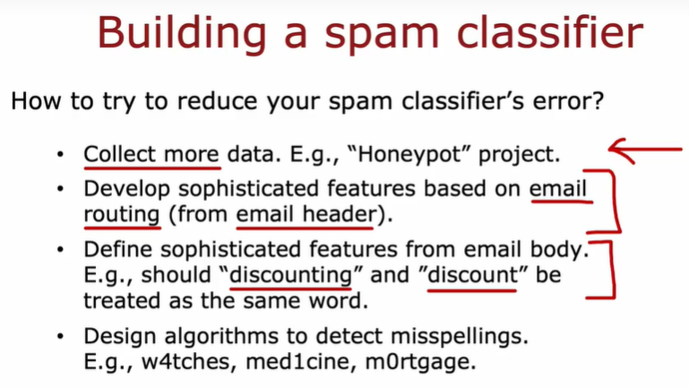

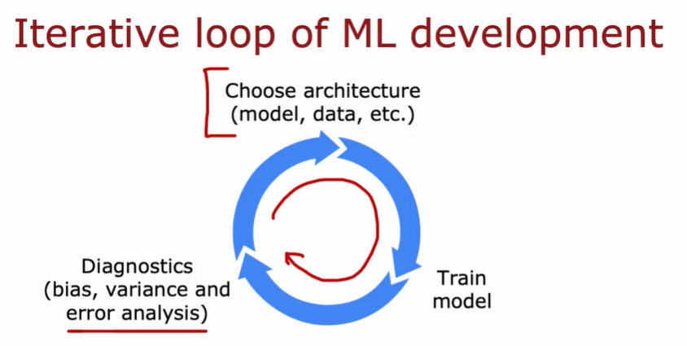

**error analysis**的重要性

## 数据添加-adding data

>  专项的添加需要的数据，比一味的添加各种数据更加有效，怎么寻找方法来改进代码

**数据增强**-Data augmentation：用已有的例子去构造新例子

构造丰富的数据库，让机器学习的更加稳健

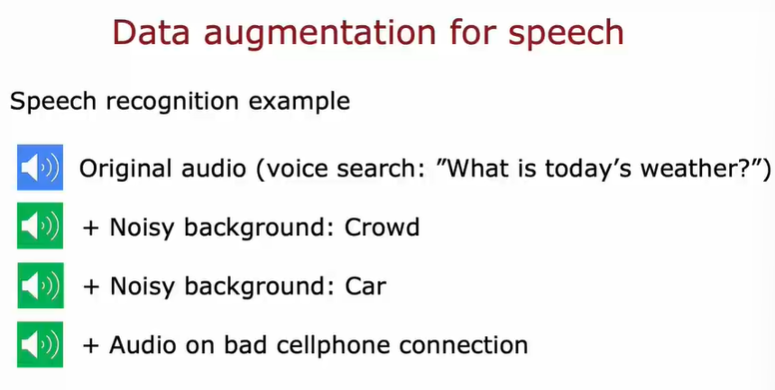

音频的叠加与加噪，用来训练

有一些处理，比如说噪点之类的，平时生活中遇不到，所以就不做这些处理

**OCR**算法

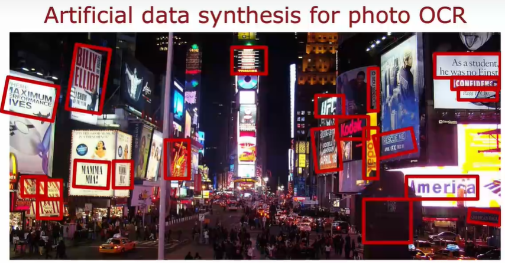

右侧是自己做的数据集，说明完全可以自己去生成数据集以减少处理数据花费的时间

有的专注于改进代码，有的算法已经够好了，就要在数据上下功夫

## 迁移学习-transfer learing

> 把其他的数据用到自己的身上（但是要相近，比如识别猫的用来识别狗）就像兽医给人看病

option1适合小的网络，opinton适合所有的(小的用1比较好)，**Fine tuning**-微调

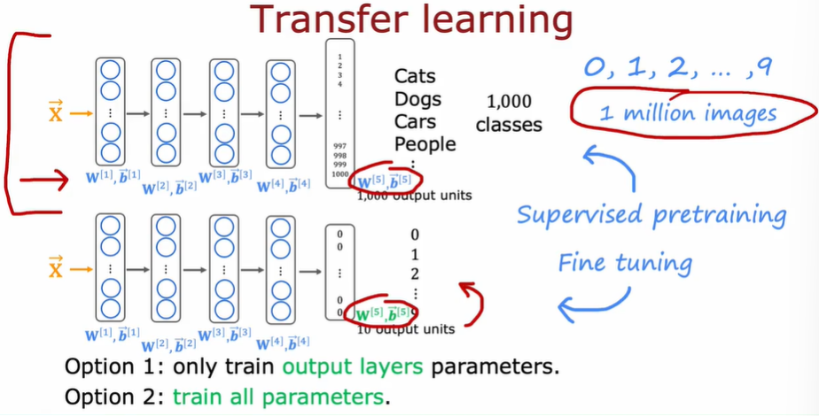

就像识别人之前，可以先训练去学习识别其他东西（这里相同的类型指不要用图像识别去识别语音）

微调就可以用少量的数据集去训练

主要是大家可以用来互相交流，用那些训练过的大型网络

# 构造系统的全流程

- 确定计划
- 收集数据
- 模型训练（再看看还要什么数据）
- 发布（维护，更新）

**inference server**-推断服务器，**monitoring**-监控系统（统计什么时候训练不好以方便观察改进）

**opera**-维护，运作

# 公平，偏见，伦理-fairness，bias，ethics

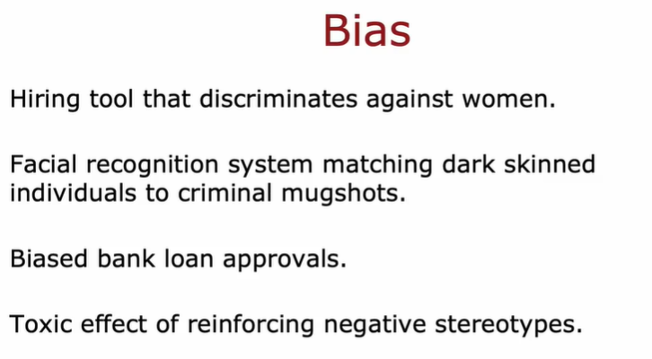

要对社会有积极影响，不要为了钱而损害社会

**diverse**-多元化（种族，性别，信仰等等，这里指团体的）

**audit**-检查，审计，大学生旁听

# 选修-数据倾斜与优化方法

## 数据倾斜介绍

数据并非55开，错误数据很少时

如果是一个很罕见的症状，正确率99.5%或者说错误率0.5%，也说明误差最小的不一定是最准的

**precision**-精确率（你识别的这些阳性，有多少是真阳的），**recall**-召回率（所有的阳性里，真正识别出来的是多少）

如果只是print（y=0)那么矩阵是[0 0;1 99],此处假设100个人里1个阳性，那么precision是0/0（无定义or不存在精度），recall是0

## 权衡精度与召回率

精度-==找的对==，召回率-==找的全==，实际上喜欢两个都高

阈值提高（更自信才预测）-[小 小；大 大]精度提高（更值得相信），但是召回率变小（看公式）

阈值降低（都来治病）-[大 大；小 小]精度降低，召回率变大

**threshold**-门槛，阈值

==推导过程==
$$
&pre = \frac{tru}{tru + fal pos}\\
&rec = \frac{tru}{tru + fal neg}\\
阈值提高：&tru小，falpos小，falneg大，truneg大\\
&pre = \frac{1}{1+\frac{falpos}{tru}}\\
&falpos = a - x,tru = b - x,\frac{falpos}{tru}=\frac{a-x}{b-x} = 1+\frac{a-b}{b-x}\\
&一般来说，a<b,所以在x从0到min\{a,b\}过程中，比值减小，pre增大\\
&rec = \frac{1}{1+\frac{falneg}{tru}}\\
&比值变大，rec变小\\
阈值降低：&tru大，falpos大，falneg小，truneg小\\
&pre = \frac{1}{1+\frac{falpos}{tru}}\\
&falpos = a - x,tru = b - x,\frac{falpos}{tru}=\frac{a-x}{b-x} = 1+\frac{a-b}{b-x}\\
&一般来说，a<b,所以在x从0到-\infty过程中，比值变大，pre减小\\
&rec = \frac{1}{1+\frac{falneg}{tru}}\\
&比值变小，rec变大
$$
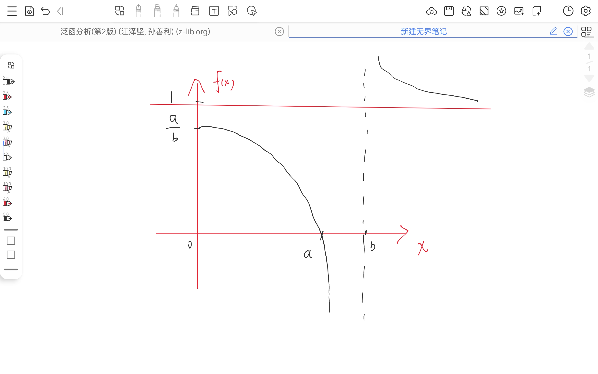

找个方法把两个数结合成新数（平均值，不推荐，不够有效，容易一边倒）**F1 score**更强调小的那个数

