# WEEK 10

[TOC]

# 前言-什么是强化学习

**reinforcement learning**-强化学习

我们如何编程来让他自己飞行，让他倒飞

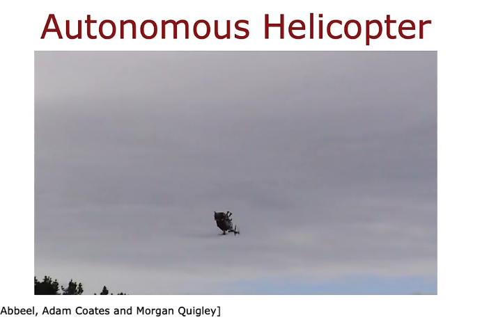

**state x** to **action y**

有点儿像训狗（奖惩机制）-**reward function**-奖励函数

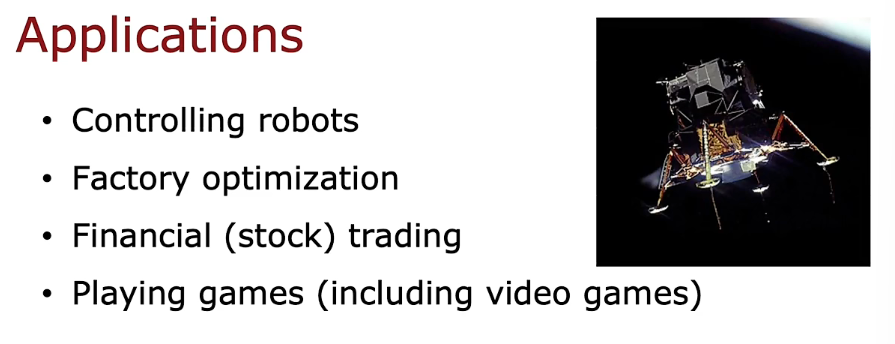

无监督学习，只要给他一个奖惩函数，让他自己学习

# 强化学习

## 案例：Mars rover example

**Mars rover**-火星漫游者，**terminal state**-最终状态

- s-state，a-action，R-reward，s'-next state

## 强化学习中的回报-Return

快速少回报vs慢速多回报  折扣因子-$\gamma$

可以理解成货币的时间价值（利息）

可以对比，取**max**，得到最终方案

实际上是在把副作用推到未来，越发展乘的次数越高，越不值钱

## 强化学习中的策略

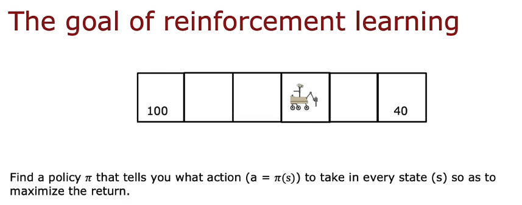

## 复习关键概念-马尔可夫决策过程MDP

> **Markov Decision Process**-马尔可夫决策过程
>
> 未来只取决于目前的状态，只与位置有关，与过程无关

# 模型中的递归

## 状态值函数-State action value function

如何看**optimal behave**-最佳决策（如果知道最佳了，那还求Q？）实际上是个包含循环的定义

Q实际上是action完了之后，你能拿到的最多的奖励(还是会按奖励最多的方案走)

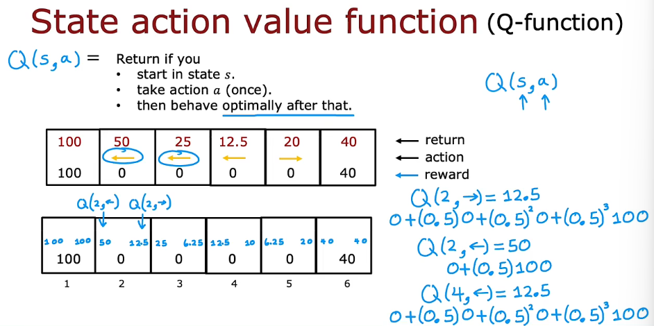

下面是Q的值，我们要让Q达到最大化
$$
max_a{Q(s,a)}
$$

只要我们可以计算Q就可以了最优Q函数

## 案例：State-action value function example

这里提供给你可以自己实验，那个因子越大实际上就是机器人越有耐心，越可以花更多时间去接受更大的奖励。

## 贝尔曼方程-Bellman Equation

> 我们怎么计算Q，就要用到贝塞尔方程

下面是符号定义(递推公式)

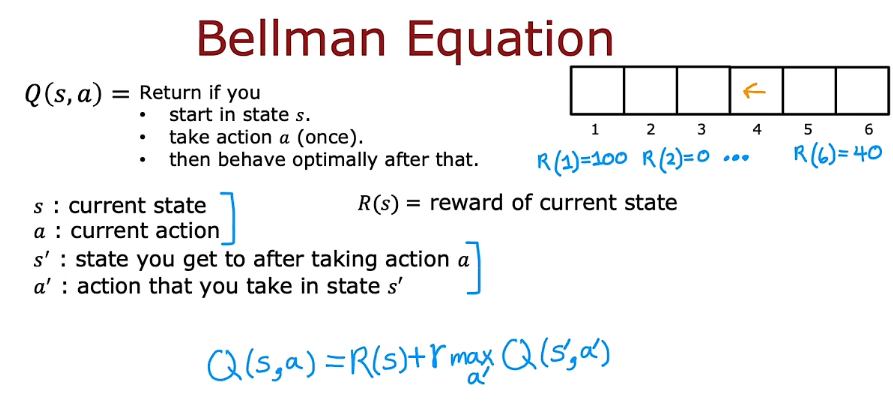

实际上二维平面下区别不大，这是在为之后的多情况考虑，需要一个状态转移公式

immediate rewaed-即时奖励-R，迭代中maxQ那一步实际上算是
$$
R_1+rR_2+r^2R_3+\dots+r^{n-1}R_n \rightarrow rR_1+r^2R_2+r^3R_3+\dots+r^nR_n
$$
换做不同的因子也是这样(==递归==)

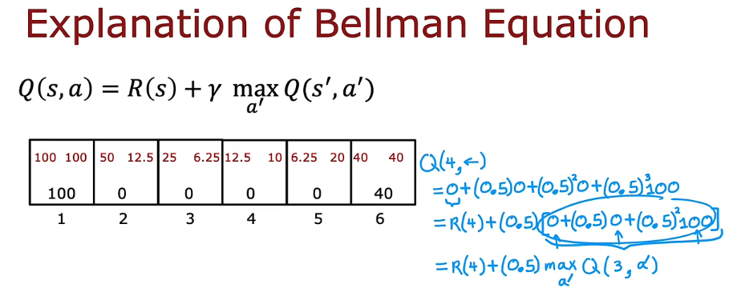

## 随机马尔可夫过程

运动方向具有概率，停时，等等，概率论都回来了。

即访问过程随机，可以想象成来回蹦

图上第二次是4到3又失误回到了4

> 当问题不明确时，都会变成随机，我们可以加大数量级求平均，实际上就是数学期望。

你3向左可能是2，也可能是4，所以加上一个随机处理

0.1的可能走错方向（滑落）

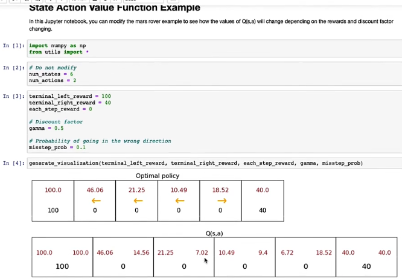

控制程度越低（出错概率越大），期望数值就会越小。

# 连续状态空间

## 应用案例

> 推广到连续状态空间

如果是汽车，可能要考虑x，y，角度，速度，角速度等等，状态可能是个向量表示

如果是直升机，三维空间的坐标与运动速度

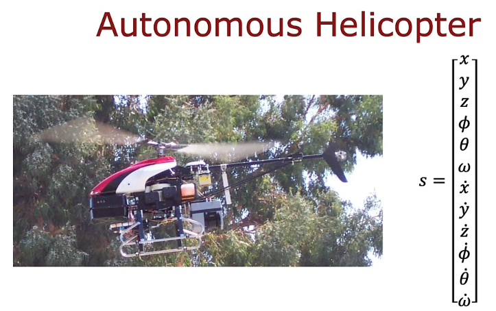

## 案例-登陆月球

## 案例介绍

左右与下的引擎可以启动

不断决定喷射力度以最终落到目标位置

给他四个action-nothing left right mian

l,r表示左，右脚是否着地(0.1)

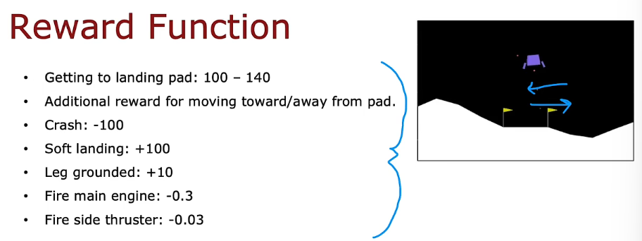

后两个是每次启动引擎会扣分(费油)

通过神经网络与深度学习就可以实现了

## 状态值函数

四个action用[1 0 0 0]四个数字符控制。计算四个Q然后选最大的

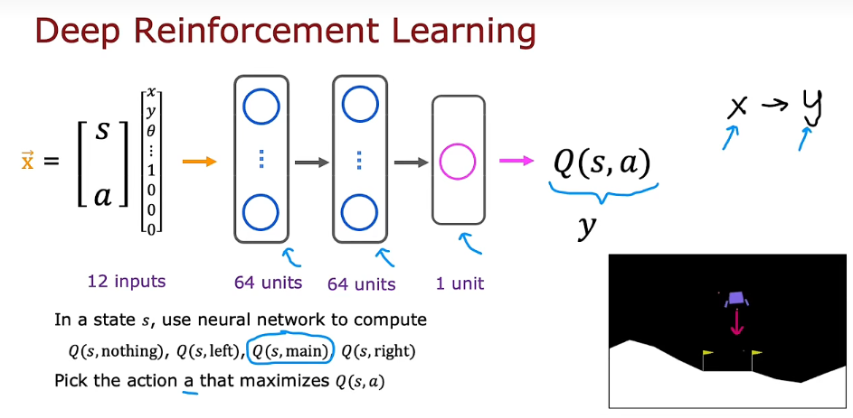如果是神经网络，我们需要大量的x，y数据训练集

可以采取随机动作，我们获得大量的样本
$$
max_{a'}Q(s'^{(1)},a')实际上就是全局搜索\\
看有没有合适的(s^{(j)},a^{(j)})=(s'^{(i)},a'^{(i)})\\
或者去逼近，Q实际上也可以用上一些相对应的表达式比如\\
Q_{w,b}(s,a)=ws+a+b之类的
$$
然后后续的计算实际上就是递归到停止时刻，至于Q是个啥

这里的Q实际上就是一个映射，没有具体的模型

**DQN方法**-DQ网络（Deel learning for Q）

深度学习是一种特殊的机器学习，实际上就是多层 嵌套的机器学习

这里对Q的处理也会像之前一样有一定的迭代处理,相当于一步一步迭代

## 改进算法：神经网络架构

同时输出四个Q值（向量方法）

使得算法更加有效

## 改进算法：$\epsilon$贪婪策略

**$\epsilon$ greedy policy**-$\epsilon$贪婪策略

也要尝试其他的可能性与动作（因为随机初始化，会导致所有的情况一直降低，但是有时还是有用的），所以加个出现误差的小概率。

**exploration step**-探索步骤，**exploitation step**-剥削步骤

贪心实际上是95%的那一部分指的是贪心(还就那个从狂野逐步收敛)

## 改进算法：Mini-batch and soft update

Mini-batch：可以加快算法

Soft update：更好收敛

> 每次梯度下降，可以不必计算那么多数据，可以每次循环选择一个小的数据量，依次往后循环完

关于合理性，实际上就是一步一步去精细化

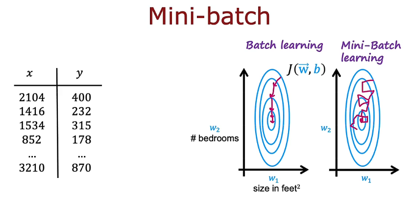

实际上没之前迭代的精细，但是更快乐（中间可能出现不好的样本使得其偏离路径）

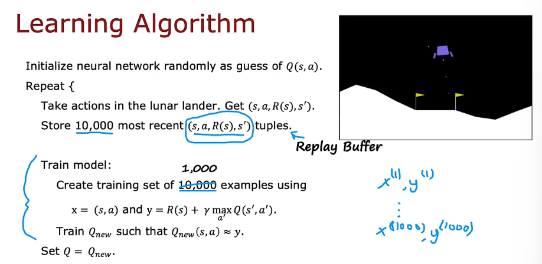

因为训练好了之后的Q就可以用到之后的数据里了，更方便更快了，但是可能一个不好的Q覆盖一个好的Q，soft update就可以改善这一点

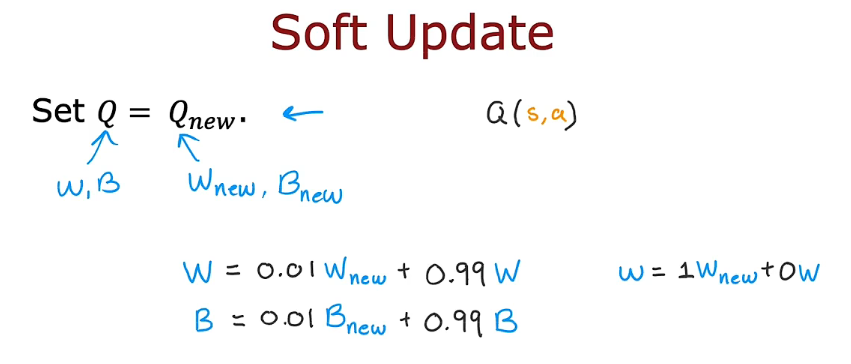

> 只是改一点点，可以降低错误带来的影响

# 强化学习现状

大肆宣传：大部分都是在模拟现实中，但是实际上非常有挑战

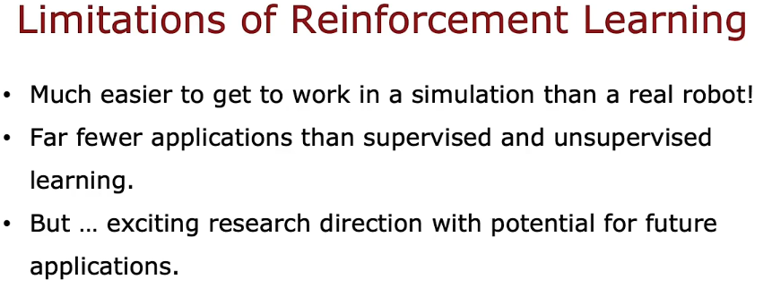

# 完结撒花

**SUMMARY**

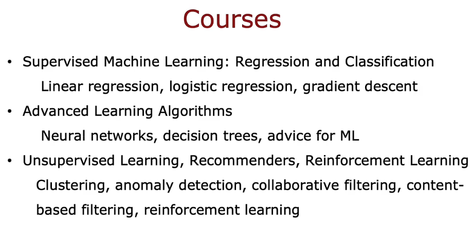

THE END

# 附录-代码理解

> 代码是copy的，用来了解了解

    %%%%%%%%%%%%%%%%%%%%%%%%%%%%%%%%%%%%%%%%%%%%%%
    % 机器人如何从五个房间中的任意一个走出来？
    % 中南大学 自动化学院 智能控制与优化决策课题组
    %%%%%%%%%%%%%%%%%%%%%%%%%%%%%%%%%%%%%%%%%%%%%
    % Q学习算法
    % function Q = Reinforcement_Learning(R,gamma)
    clear all
    clc;
    format short    %显示4位小数
    format compact  %压缩空格
    
    % 输入: R and gamma
    % R：即时奖励矩阵; 行、列表示状态
    % -1 = 表示无效值
    R = [-1,-1,-1,-1,0, -1;
         -1,-1,-1,0,-1, 100;
         -1,-1,-1,0,-1, -1;
         -1, 0, 0,-1,0, -1;
          0,-1,-1,0,-1, 100;
         -1,0, -1,-1,0, 100];
    gamma = 0.80;            % 学习参数
    
    N = size(R,1); % R的行数，所有状态的个数，一行代表一个状态的所有信息
    Q  = zeros(size(R));     % 初始化Q矩阵，其行数和列数和R一样。Q初始全是0
    Q1 = ones(size(R))*inf;  % 前一次比较对象，判定收敛，Q初始全是无穷大
    count = 0;               % 计数器
    for episode = 0:50000
       % 产生随机初始状态
       state = ceil(N*rand);    %产生1-N之间的随机数
       % 从当前状态出发，选择一个行动
       x = find(R(state,:)>=0);   % 所有可能行动,R(state,:)代表R的第state行,find(R(state,:)>=0)代表R的第state行里面大于0的数的列位置集合，是个行向量，
       %上一句代码理解成找出当前状态可以向那些状态转移
       if ~isempty(x)   %如果有可以转移的
          x1= x((ceil(length(x)*rand)));                  % 随机选择一个行动，理解成随机向一个状态转移，x1代表第几行（即为第几个状态）
       end
     
       qMax = max(Q,[],2);   %返回矩阵中每行的最大值，是一个列向量，大小是Q的行数，每行最大值物理含义是这个状态下的最好奖励（最好出路)
       Q(state,x1) = R(state,x1) + gamma*qMax(x1);   % 转移规则。qMax(x1)代表x1这个状态下的最好奖励
       
       % 判定是否收敛  其实就是前后两个Q矩阵的差很小就认为是收敛了
       if sum(sum(abs(Q1-Q)))<0.0001 && sum(sum(Q>0)) %sum(sum(Q>0))代表Q大于0的数的个数,sum(sum(abs(Q1-Q)))代表Q1与Q对应位置相减绝对值之和
          if count > 1000         %且学习了超过1千次
              disp(strcat('强化学习的总次数： ',num2str(episode)));     
             break                %跳出for循环
          else                    %没有学习了超过1千次
             count = count+1; 
          end
       else  %不收敛，差距很大
          Q1 = Q;  %把最新的一个Q作为比较对象，覆盖掉原来的
          count = 0; 
       end
    end%归一化
    Qmax = max(max(Q));%max(max(Q))代表Q里面最大的元素，max(Q)代表每一列最大的元素
    if Qmax >0
        Q = 100*Q/Qmax;
    end
    Q'

> qMax = max(Q,[],2);   %返回矩阵中每行的最大值，是一个列向量，大小是Q的行数，每行最大值物理含义是这个状态下的最好奖励（最好出路)
>    Q(state,x1) = R(state,x1) + gamma*qMax(x1);   % 转移规则。qMax(x1)代表x1这个状态下的最好奖励

实际上就是我们刚开始就假设所有状态点的Q，然后一步步更新，刚开始全是0，那么就直接全是R
