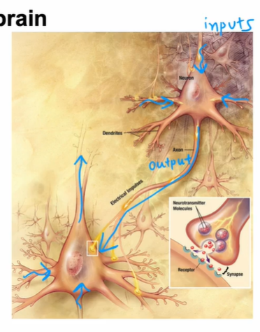
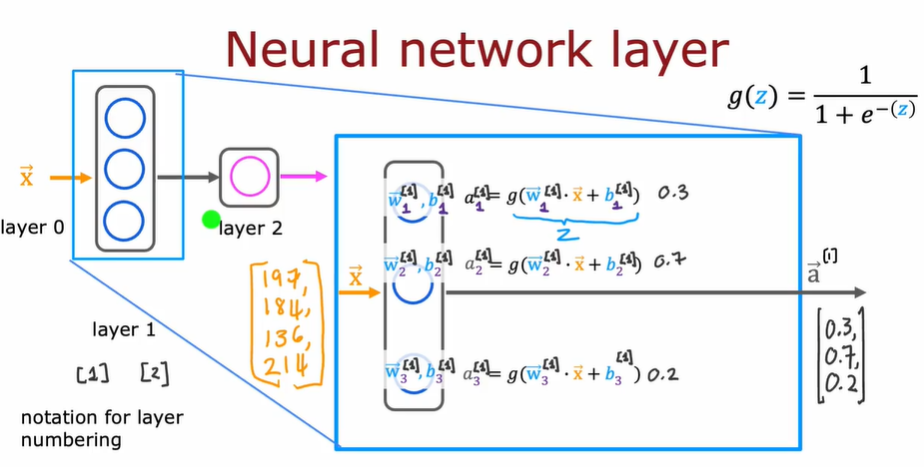
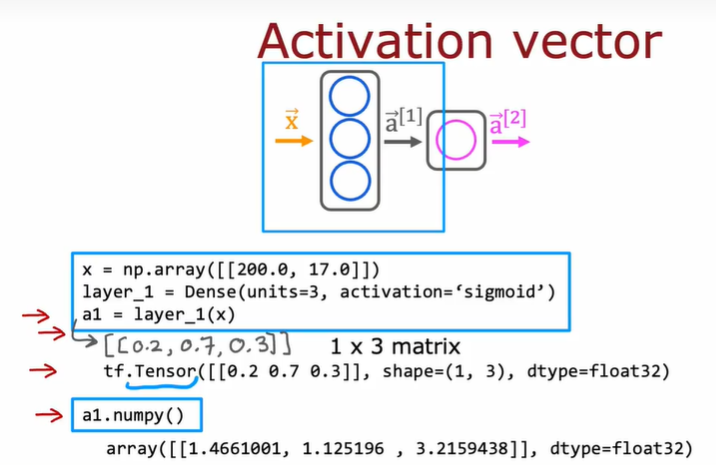
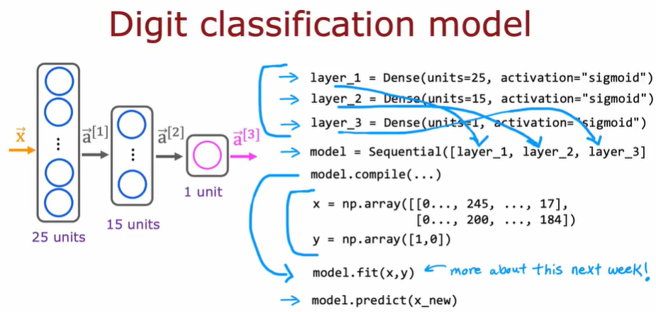
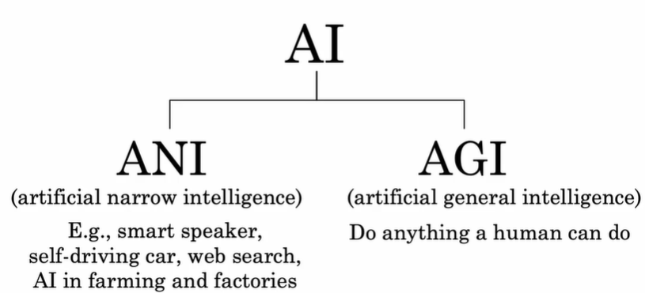
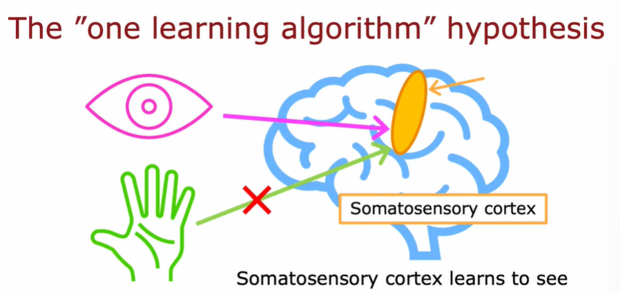
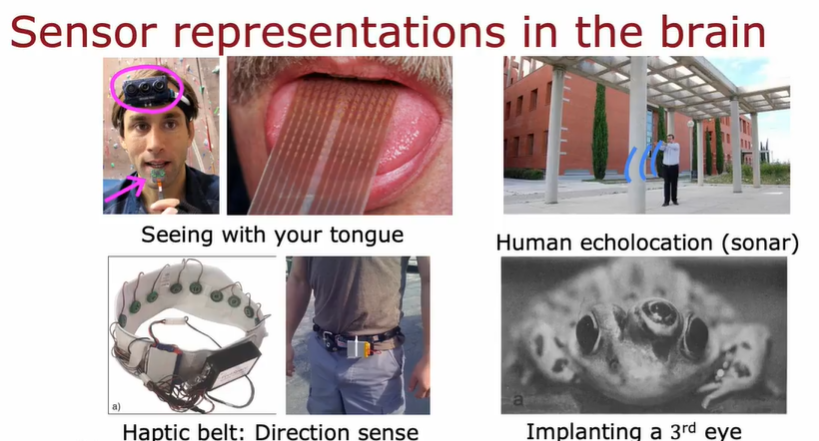
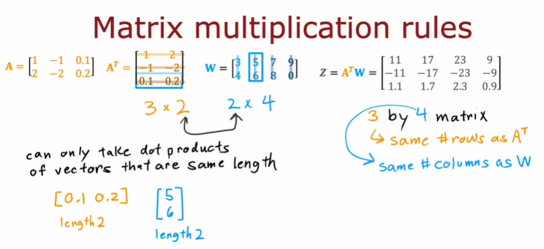
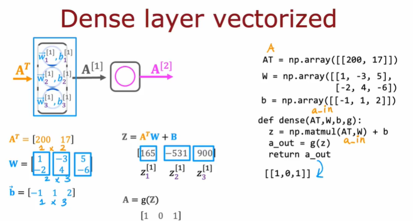

# WEEK 4

[TOC]

# 开篇

**Neural Networks**-神经网络

**inference**-推理

# 神经网络-Neural Networks

> 超级简化的人类大脑

## 神经网络介绍

NLP-自然语言处理

**axon**-轴突，**dendrites**-树突

大脑是如何工作的尤为重要，出发点是生物原理，但是更重要的还是工程原理，我们怎么有效的工作。利用神经网络可以利用更多的数据。

## 需求预测-Demand Prediction

**activation**-激活，**neuron**-神经元，**awarenss**-知名度

用神经元输出估价的概率

实际上下一层可以读取上一层的所有数据，每层输入一个数据，输出一个数据

**input layer** 输入层（layer0）-**hidden layer** 隐藏层（layer1）-**output layer **输出层（layer2）

> 输入层一般不记，故上述的只是一个==2层网络==

神经网络不用我们自己处理数据特征，可以借助网络自己生成合理的权重。

**architecture**-结构，:D

## Example:视觉处理-Face recognition

第一层：找各种直线；第二层：检测脸部部位；第三层：组成人脸；实际上是从小到大的区域范围搜索（不过都是机器自己学习）

不仅仅是人脸，这套系统会自动小范围到大范围找到合适的分类（比如对汽车）

## 神经网络层-Neural network layer

1. 第一步，计算layber1

【i】的数据输入到【i+1】

2. 第二步，计算layber2

3. 第三步，对结果进行判断

## 更加复杂的神经网络

信息输出与传递的方程（第一层就是$a^{[0]}$）

# 推理-Inferencing

## 向前传播(手写识别)-forward propagation

forward propagation-向前传播，传播激活信号

## 代码部分-Inferencing in code

- 咖啡豆问题-coffee roasting

要加载各个参数以及库的提取应用。

- 手写识别问题

## Tensorflow 中的数据

numpy中的矩阵数据表达：

**row**-行，**column**-列

最后一个只是表达一组数据；**tensor**-张量，用来储存数据。张量可以视为高维矩阵的储存方式（用长方体储存数据）

> 这里最后一行应该是弄错了,应该只是转了一下格式

# 构造一个神经网络

## 调用库写函数

model中sequential用来给layer排序。然后输入数据去训练

一遍一遍的驯化这个函数

这就体现了库的方便，但是还是要实际上理解库中的东西，要了解算法怎么工作的。

## 单层中的前向传播-Forward prop in a single layer

> 这里是先算的下面再算的上面，==w2_1中应该是三维向量==，可以改成([-7，8，9])

**实现方法**-Tensorflow算是一种张量计算的架构

定义函数，输入上一层参数，系数阵，得到下一层参数。

> 实际上这里应该用矩阵（向量）相乘更好-a_in乘W+b
>
> 会根据代价函数一步一步往前修改参数（反向传播）

- **前向传播（Forward Propagation）**前向传播就是从input，经过一层层的layer，不断计算每一层的z和a，最后得到输出y^ 的过程，计算出了y^，就可以根据它和真实值y的差别来计算损失（loss）。
- **反向传播（Backward Propagation）**反向传播就是根据损失函数L(y^,y)来反方向地计算每一层的z、a、w、b的偏导数（梯度），从而更新参数。

# AGI猜想-Is there a path to AGI

**ANI**-Artificial General Intelligence-强人工智能，**AGI**-Artificial Narrow Intelligence-弱人工智能

我们想的可能越多的neuron，就能模拟人脑，但是还是太简单，未能达到模拟人脑的程度。

"one learning algorithm" hypothesis-简单算法猜想

听觉的切断把视觉输入，会自动接受视觉（就像有一个算法，我们的算法“大脑”接收数据并生成结果）

生物具有惊人的适应性，那么能够复制这些算法吗。

# 向量化求解-矩阵部分

- 向量化的成就铸就了今天的深度学习

看是否大于0.5取得0，1所以最后输出的都是0.1

- **dot product**-点积（点乘），**transpose**-转置

向量化复杂，但是很值

# 神经网络向量化实现

直接用矩阵乘积进行传播。

